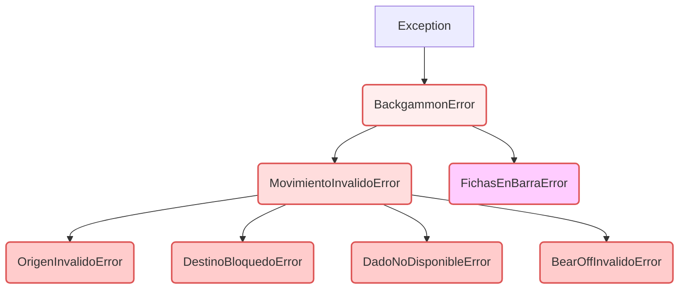

# Documentación Arquitectónica: Backgammon Core

## 1\. Introducción y Principios de Diseño

[cite\_start]Este documento detalla la arquitectura del juego de Backgammon, la cual se basa en el **Diseño Orientado a Objetos (POO)** y aplica rigurosamente los principios **SOLID** para garantizar la testabilidad, la mantenibilidad y la clara **Separación de Responsabilidades (SRP)**[cite: 1085, 1103, 1485]. [cite\_start]La lógica de negocio (Core) está completamente desacoplada de la interfaz de usuario (CLI o Pygame UI), siguiendo el **Principio de Inversión de Dependencias (DIP)**[cite: 1093, 1103].

### Principios SOLID Aplicados

| Principio | Aplicación en el Core |
| :--- | :--- |
| **SRP** (Single Responsibility Principle) | [cite\_start]Cada clase (Tablero, Dados, Validador) tiene una única razón para cambiar[cite: 1103, 1485]. |
| **OCP** (Open/Closed Principle) | [cite\_start]El `Backgammon` es el orquestador (cerrado para modificación) y permite nuevas UIs (abierto para extensión)[cite: 1103]. |
| **LSP** (Liskov Substitution Principle) | [cite\_start]La jerarquía de excepciones permite sustituir la base `BackgammonError` por cualquiera de sus subtipos[cite: 1103]. |
| **ISP** (Interface Segregation Principle) | [cite\_start]El `Tablero` expone métodos públicos (copias) para la UI y métodos protegidos (referencias) para el Core interno[cite: 1094]. |
| **DIP** (Dependency Inversion Principle) | La clase `Backgammon` depende de clases concretas, pero la inyección de dependencias hace al sistema flexible para pruebas (mocking). |

-----

## 2\. Mapa Mental y Diagrama de Clases

[cite\_start]La arquitectura se organiza mediante el patrón **Composición sobre Herencia**, donde la clase `Backgammon` (Fachada) delega todas las tareas operativas a sus componentes especializados[cite: 1094].

### Diagrama de Clases (Relaciones de Composición)

```mermaid
graph TD
    subgraph Core
        A[Backgammon (Coordinador)] --> B[Tablero (Estado)]
        A --> C[Dados (Aleatoriedad)]
        A --> D[GestorTurnos (Dirección)]
        A --> E[ValidadorMovimientos (Reglas)]
        A --> F[EjecutorMovimientos (Acción)]
        A --> G[AnalizadorPosibilidades (Simulación)]
        E --> B
        E --> D
        F --> B
        F --> D
        G --> B
        G --> D
    end

    subgraph Presentación
        H[CLI (Interfaz Consola)] --> A
        I[PygameUI (Interfaz Gráfica)] --> A
    end

    style A fill:#f9f,stroke:#333,stroke-width:2px
    style B fill:#ccf,stroke:#333,stroke-width:2px
    style E fill:#aaf,stroke:#333,stroke-width:2px
    style F fill:#aaf,stroke:#333,stroke-width:2px
    style G fill:#aaf,stroke:#333,stroke-width:2px
    style H fill:#ffc,stroke:#333,stroke-width:2px
    style I fill:#ffc,stroke:#333,stroke-width:2px
```

-----

## 3\. Explicación Detallada de Clases y Atributos

### 3.1. `Backgammon` (Coordinador / Fachada)

| Elemento | Responsabilidad y Justificación | Funcionamiento |
| :--- | :--- | :--- |
| **Rol Principal** | **Orquestador central** del juego. [cite\_start]Su método `mover()` actúa como una Fachada, integrando validación, manejo de barra, ejecución y consumo de dados[cite: 1094, 1485]. | Controla el flujo completo. **Nunca** contiene lógica directa de reglas o estado. |
| **Atributos** | | |
| `__tablero__` | Mantiene el estado del juego. [cite\_start]Se utiliza Composición (tiene un `Tablero`) en lugar de herencia, cumpliendo con LSP[cite: 1094, 1485]. | Instancia de `Tablero`. |
| `__movimientos_pendientes__` | Almacena los valores de dados disponibles ([3, 5] o [6, 6, 6, 6]) que deben consumirse. | `list[int]` que se vacía al `finalizar_tirada`. |
| **Métodos Clave** | | |
| `mover(origen, dado)` | **Método Fachada**. Procesa la solicitud completa: 1. Valida `dado mayor`. 2. Prioriza `barra`. 3. Llama a `Validador` y `Ejecutor`. 4. Consume el dado. | Lanza excepciones específicas (`DadoNoDisponibleError`, `OrigenInvalidoError`, etc.). |
| `_validar_dado_mayor(dado)` | Regla especial: si solo se puede usar un dado, debe ser el mayor. Delega en `AnalizadorPosibilidades`. | Lanza `DadoNoDisponibleError` si se usa el dado incorrecto. |
| `tirar_dados()` | Inicializa `__movimientos_pendientes__` con 2 o 4 valores (para dobles). | Devuelve una tupla `(d1, d2)`. |

### 3.2. `Tablero` (Gestor de Estado)

| Elemento | Responsabilidad y Justificación | Funcionamiento |
| :--- | :--- | :--- |
| **Rol Principal** | [cite\_start]Encapsular y gestionar el estado interno del juego (posiciones, barra y fichas fuera)[cite: 1094, 1451]. | **No contiene lógica de reglas de movimiento**, solo la estructura de datos. |
| **Atributos** | | |
| `__posiciones__` | **Representación con enteros con signo**. Positivo = Blancas, Negativo = Negras. [cite\_start]Permite cálculos algebraicos de movimiento y colisiones[cite: 1097]. | `list[int]` de 24 elementos (0 a 23). |
| `__barra__` | Fichas capturadas que deben reingresar al tablero. | `dict[str, int]` con claves `'blancas'` y `'negras'`. |
| **Métodos Clave** | | |
| `obtener_posiciones()` | **API Pública**. Retorna una **copia defensiva** (`list(self.__posiciones__)`). | [cite\_start]Protege el estado interno de modificaciones externas (Encapsulación, ISP)[cite: 1094]. |
| `_obtener_posiciones_ref()` | **Método Protegido**. Retorna la **referencia directa**. | [cite\_start]Usado por `EjecutorMovimientos` y `AnalizadorPosibilidades` para modificar/simular eficientemente[cite: 1094]. |
| `hay_fichas_en_barra(color)` | Consulta el estado de la barra. | Lanza `ValueError` si el `color` es inválido. |

### 3.3. `GestorTurnos` (Control de Flujo)

| Elemento | Responsabilidad y Justificación | Funcionamiento |
| :--- | :--- | :--- |
| **Rol Principal** | Controlar qué jugador debe moverse y la dirección de su movimiento. | Se separa del `Backgammon` para cumplir con SRP. |
| **Atributos** | | |
| `__turno__` | Entero con signo para representar el jugador actual. **1** para blancas, **-1** para negras. | El uso de `int` facilita el cálculo de destino: `origen + direccion * dado`. |
| **Métodos Clave** | | |
| `obtener_direccion()` | Devuelve `1` (blancas avanzan de 1 a 24) o `-1` (negras avanzan de 24 a 1). | Crucial para la lógica de movimiento en todos los servicios de reglas. |
| `cambiar_turno()` | Simplemente alterna el valor de `__turno__` entre `1` y `-1`. | No tiene lógica de limpieza (eso es responsabilidad de `Backgammon.finalizar_tirada`). |

### 3.4. Servicios de Lógica (Validador, Ejecutor, Analizador)

| Clase | Responsabilidad Única (SRP) | Método Clave | Justificación y Funcionamiento |
| :--- | :--- | :--- | :--- |
| **`ValidadorMovimientos`** | **Verifica la legalidad** de un movimiento sin modificar el estado. | `validar_movimiento()` | Verifica origen válido, destino no bloqueado (máx. 1 ficha rival) y reglas de *bear-off*. |
| | | `_todas_en_home()` | Lógica de la regla: chequea si todas las fichas están en el *home* para permitir el *bear-off*. |
| **`EjecutorMovimientos`** | **Aplica el movimiento** cambiando el estado del tablero y la barra. | `ejecutar_movimiento()` | Mueve la ficha, maneja la captura de *blots* (enviando la ficha rival a la barra) y detecta la victoria. |
| | | `_ejecutar_bear_off()` | Saca una ficha del tablero e incrementa `__fichas_fuera__`. Contiene la lógica de fin de juego (15 fichas fuera). |
| **`AnalizadorPosibilidades`** | **Analiza y simula** posibles movimientos. Necesario para reglas complejas. | `debe_usar_dado_mayor()` | **Implementa la regla más compleja**: Simula movimientos internamente con `_simular_mejor_movimiento` para determinar si el dado menor desbloquea al mayor. |
| | | `hay_movimiento_posible()` | Comprueba si existe **alguna jugada válida** con los dados pendientes (usado después de tirar y antes de finalizar turno). |

-----

## 4\. Jerarquía y Manejo de Excepciones

El sistema utiliza una jerarquía de excepciones personalizada para ofrecer **retroalimentación precisa** y permitir a la capa de presentación (UI) reaccionar de manera diferente a cada tipo de error.

### Jerarquía de Excepciones



### Mapeo y Justificación

La clase `Backgammon` utiliza el método `_lanzar_excepcion_apropiada(mensaje_error)` para mapear los mensajes de error internos (generados por `ValidadorMovimientos`) a la excepción pública adecuada.

| Excepción | Palabra Clave Mapeada | Razón de la Granularidad |
| :--- | :--- | :--- |
| `OrigenInvalidoError` | `"origen"` | El jugador no tiene fichas propias en esa posición. |
| `DestinoBloquedoError` | `"bloqueada"`, `"bloqueado"` | El destino contiene **2 o más** fichas rivales. |
| `BearOffInvalidoError` | `"home"`, `"insuficiente"`, `"adelantada"` | Violación de las reglas de salida (Bear-off). |
| `DadoNoDisponibleError` | (Lanzada directamente) | Se intenta usar un dado ya consumido o se está ignorando la regla del dado mayor. |
| `FichasEnBarraError` | (Lanzada directamente) | Indica que el jugador tiene la obligación de reingresar desde la barra. |